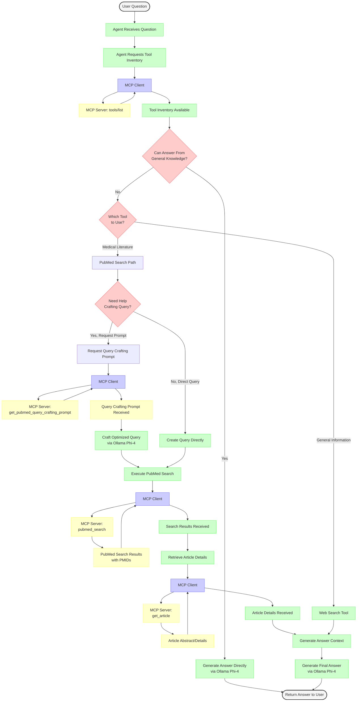

# A Biomedical research MCP server and a Research Agent using it - implementation without framework and using only local models

*Anthropic's Model Context Protocol (MCP) is an open standard designed to facilitate seamless integration between AI models, particularly large language models (LLMs), and external tools or data sources.*

I am intrigued by Anthropic's MCP model. I want to understand it better. I decided to implement a proof-of-concept server for some common tasks in biomedical research. I wanted my locally running LLMs (using ollama as inference server) to be able to search pubmed or the web in order to answer medical questions. 
I also wanted to see whether I can produce a lean system with minimal dependencies outside standard python libraries, without using any larger frameworks, commercial software, or commercial API keys. Most biomedical researchers outside the pharmaceutical industry have rather limited financial means, so zero or near zero cost systems are preferable.

One trustworthy source of medical information is the pubmed database.

*PubMed is a free, searchable database maintained by the National Library of Medicine (NLM) and its division, the National Center for Biotechnology Information (NCBI). It provides access to over 37 million citations and abstracts from biomedical and life sciences literature, primarily through its core component, MEDLINE, which uses Medical Subject Headings (MeSH) for indexing

However, querying it is sort of an art - phrasing the query sub-optimally might either miss too many relevant results, or result in a deluge of irrelevant results. While SOTA models such as Claude Sonnet 3.7 have become quite apt in translating a human language question into a good pubmed query, many smaller models struggle or even fail in that task. When working on a larger (ongoing) project of agentic query optimization , I learned to optimize prompts to instruct smaller models to perform acceptably. 

My MCP server needs to both help my LLM to craft a pubmed query based on a natural language medical question, as well as to execute the query and retrieve relevant context to the query results. 

---

## The MCP server
So, the first few tools my MCP server should serve include
- providing a prompt that will guide most smaller models towards crafting efficient and valid pubmed queries
- running a pubmed query
- retrieving publications from pubmed or the web as per query results
- formatting the retrieved context suitable for LLM processing (eg Markdown)

---

## The Agent using the server
My proof-of-concept framework-less agent should be able to
- decide whether a question requires context to answer correctly
- use the pubmed and websearch tools provided accordingly
- realize that if a pubmed query is required, it may not know how to craft a valid or efficient query, and use prompting assistance from the MCP server
- answer the question based on the retrieved/provided context

---

## Development environment, tools and libraries
Development environment will be what I am already familiar with
- VS code with Github Copilot using Claude Sonnet 3.7 for coding assistance
- flask for web serving; we will not use stdio based communication since our tools might be hosted on a variety of local servers
- beautifulsoup for web scraping
- ollama as inference server, and the python ollama library
- phi4 as example llm because it is small, fast, and does the job even on modest hardware

---

## Decision process and tool use for our agent

## How the information flows between user, agent, LLM, MCP server, and PubMed API

